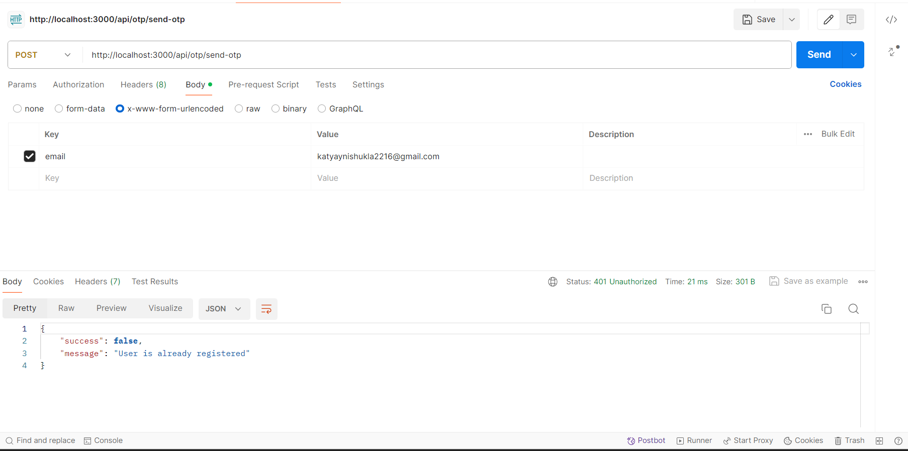

# OTP-Authentication

## User Registration and OTP Validation API using Express.js and MongoDB

This project demonstrates how to create APIs for user registration and OTP (One-Time Password) validation using Express.js and MongoDB. It provides endpoints for users to register using email and password and verifies their accounts using OTP sent to the user's email.

### Prerequisites

- Node.js installed on your machine.
- MongoDB Atlas account or local MongoDB server installed.
- Postman or any REST API client for testing.

### Installation

1. Clone the repository.
2. Navigate to the project directory.
3. Install dependencies:   

    ```bash
    npm install
    ```

4. Create a `.env` file in the root directory:
   
   ```plaintext
    MONGODB_URL = your_mongodb_connection_uri
    MAIL_HOST = your_email_service_provider
    MAIL_USER = your_email_address
    MAIL_PASS = your_email_password
    PORT = 4000
    ```

### Usage

#### OTP Sent Successfully
  
  

#### Invalid OTP Entered by User
  
  
  
#### OTP Email Sent to User
  
  
  
#### User Registered Successfully
  
  
  
#### User Already Registered
  
  
  
#### User Already Exists
  
  
  
#### Database Schema
  
  
